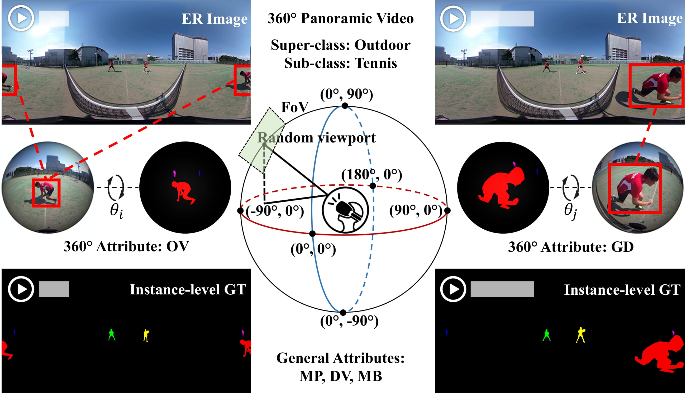
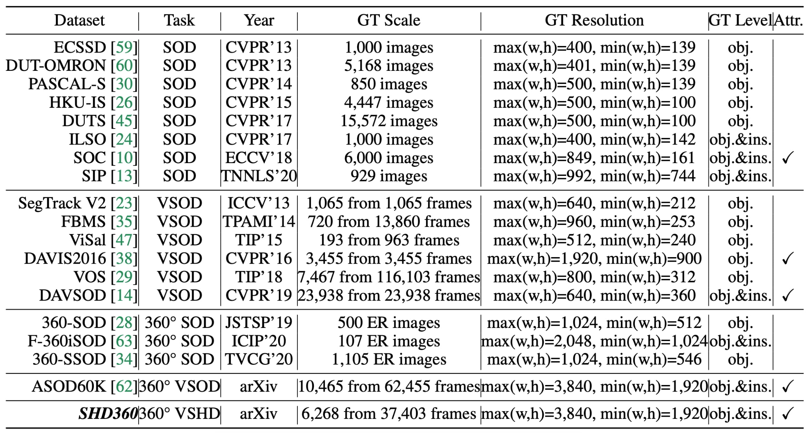
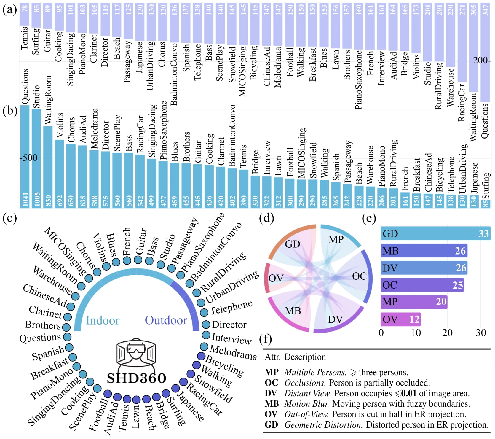
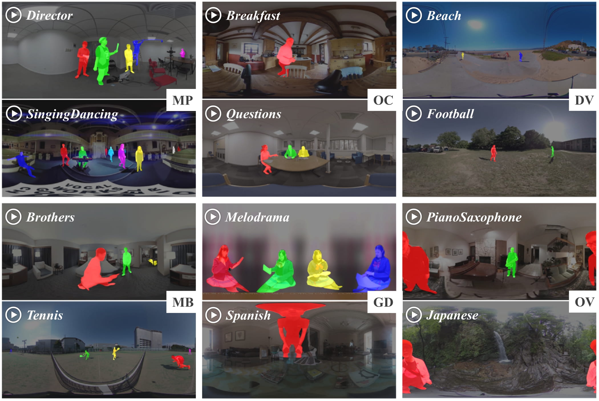
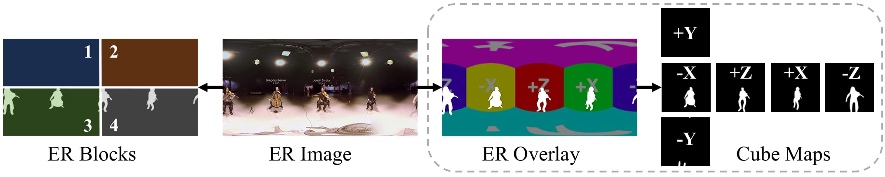
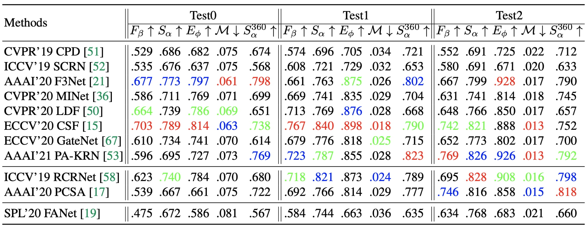
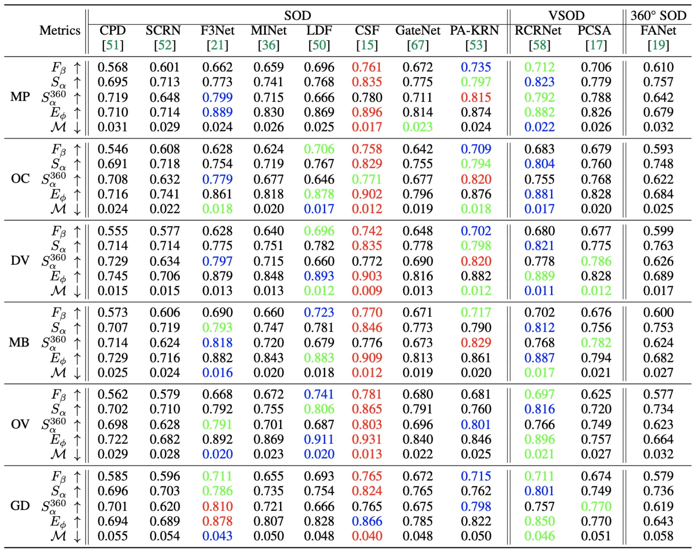

# [SHD360: A Benchmark Dataset for Salient Human Detection in 360° Videos](https://arxiv.org/abs/2105.11578)

Authors: [*Yi Zhang*](https://www.linkedin.com/in/bill-y-zhang/), [*Lu Zhang*](https://luzhang.perso.insa-rennes.fr/), [*Jing Zhang*](https://scholar.google.com/citations?user=Qa1DMv8AAAAJ&hl=en), [*Kang Wang*](), [*Wassim Hamidouche*](https://scholar.google.com/citations?user=ywBnUIAAAAAJ&hl=en), [*Olivier Deforges*](https://scholar.google.com/citations?user=c5DiiBUAAAAJ&hl=en)

# Introduction

      
    <em> 
    Figure 1: An illustration of 360° video salient human detection (VSHD). The first row, two random key frames of a 360° panoramic video from our SHD360. The shown 360° video frames are mapped to plane by conducting equirectangular (ER) projection. The middle row: a subject observes 360° content by moving his head to control the field-of-view (FoV) in a range of 360°×180°. The salient human instances with 360° attributes observed in spherical FoVs at specific rotation angles (e.g., θi, θj). The last row: corresponding annotations such as per-pixel instance-level ground truth (GT) and general attributes including MP-multiple persons, DV-distant view and MB-motion blur.
    </em>

Salient human detection (SHD) in dynamic 360° immersive videos is of great importance for various applications such as robotics, inter-human and human-object interaction in augmented reality. However, 360° video SHD has been seldom discussed in the computer vision community due to a lack of datasets with large-scale omnidirectional videos and rich annotations. To this end, we propose SHD360, the first 360° video SHD dataset which contains various real-life daily scenes. Our SHD360 provides six-level hierarchical annotations for 6,268 key frames uniformly sampled from 37,403 omnidirectional video frames at 4K resolution. Specifically, each collected key frame is labeled with a super-class, a sub-class, associated attributes (e.g., geometrical distortion), bounding boxes and per-pixel object-/instance-level masks. As a result, our SHD360 contains totally 16,238 salient human instances with manually annotated pixel-wise ground truth. Since so far there is no method proposed for 360° image/video SHD, we systematically benchmark 11 representative state-of-the-art salient object detection (SOD) approaches on our SHD360, and explore key issues derived from extensive experimenting results. We hope our proposed dataset and benchmark could serve as a good starting point for advancing human-centric researches towards 360° panoramic data. 

:running: :running: :running: ***KEEP UPDATING***.

------

# Related Works

      
    <em> 
    Figure 2: Summary of widely used salient object detection (SOD) datasets and our SHD360. GT = ground truth. ER Image = equirectangular image. Attr. = attributes. obj. = object-level GT. ins. = instance-level GT. Please note that all the datasets listed above provide pixel-wise annotations.
    </em>

------

# DataSet: SHD360

      
    <em> 
    Figure 3: Statistics of the proposed SHD360. (a)/(b) The quantity of object-/instance-level per-pixel ground-truth masks of each of the scene categories. (c) Hierarchical labels including two super-classes (indoor/outdoor) and 41 scene categories. Attributes statistics including (d) and (e) which represent correlation and frequency of proposed attributes, respectively. (f) Descriptions of the six proposed attributes associated with each of the scene categories.
    </em>

      
    <em> 
    Figure 4: Examples of instance-level pixel-wise labels and challenging attributes (please refer to Figure 3 (f) for details) of our SHD360. 
    </em>

------

# 360° Geometry-adapted S-measure

      
    <em> 
    Figure 5: A comparison between traditional S-measure and proposed 360° geometry-adapted S-measure. The former/latter compute region similarities based on ER blocks/cube maps, respectively. ’+X’,’-X’,’+Y’,’-Y’,’+Z’ and ’-Z’ denote cube maps covering a FoV of 90°×90°, observed from the right, left, up, down, front and back by a 360° camera.
    </em>

------

# Benchmark

## Overall Results

      
    <em> 
    Figure 6: Performance comparison of 8/2 SOTA SOD/VSOD methods and one 360° SOD method over the three testing sets of our SHD360. S = S-measure (α=0.5), S360 = 360° geometry-adapted S-measure, Fβ = mean F-measure (β2=0.3), Eφ = mean E-measure, M = mean absolute error. ↑/↓ denotes a larger/smaller value is better. The three best results of each column are in red, blue and green, respectively.
    </em>

## Attributes-based Results

      
    <em> 
    Figure 7: Attributes-based performance comparison of 11 baselines over our SHD360. ↑/↓ denotes a larger/smaller value is better. Three best results of each row are in red, blue and green, respectively.
    </em>

## Reference

**No.** | **Year** | **Pub.** | **Title** | **Links** 
:-: | :-: | :-: | :-  | :-: 
01 | 2019 | IEEE CVPR   |  Cascaded Partial Decoder for Fast and Accurate Salient Object Detection | [Paper](https://openaccess.thecvf.com/content_CVPR_2019/papers/Wu_Cascaded_Partial_Decoder_for_Fast_and_Accurate_Salient_Object_Detection_CVPR_2019_paper.pdf)/[Project](https://github.com/wuzhe71/CPD)
02 | 2019 | IEEE ICCV |  Stacked Cross Refinement Network for Edge-Aware Salient Object Detection | [Paper](https://openaccess.thecvf.com/content_ICCV_2019/papers/Wu_Stacked_Cross_Refinement_Network_for_Edge-Aware_Salient_Object_Detection_ICCV_2019_paper.pdf)/[Project](https://github.com/wuzhe71/SCRN)
03 | 2020 | AAAI   |  F3Net: Fusion, Feedback and Focus for Salient Object Detection | [Paper](https://arxiv.org/pdf/1911.11445.pdf)/[Project](https://github.com/weijun88/F3Net)
04 | 2020 | IEEE CVPR  |  Multi-scale Interactive Network for Salient Object Detection | [Paper](https://openaccess.thecvf.com/content_CVPR_2020/papers/Pang_Multi-Scale_Interactive_Network_for_Salient_Object_Detection_CVPR_2020_paper.pdf)/[Project](https://github.com/lartpang/MINet)
05 | 2020 | IEEE CVPR |  Label Decoupling Framework for Salient Object Detection | [Paper](https://openaccess.thecvf.com/content_CVPR_2020/papers/Wei_Label_Decoupling_Framework_for_Salient_Object_Detection_CVPR_2020_paper.pdf)/[Project](https://github.com/weijun88/LDF)
06 | 2020 | ECCV       |  Highly Efficient Salient Object Detection with 100K Parameters | [Paper](https://www.ecva.net/papers/eccv_2020/papers_ECCV/papers/123510698.pdf)/[Project](https://github.com/ShangHua-Gao/SOD100K)
07 | 2020 | ECCV       |  Suppress and Balance: A Simple Gated Network for Salient Object Detection | [Paper](https://www.ecva.net/papers/eccv_2020/papers_ECCV/papers/123470035.pdf)/[Project](https://github.com/Xiaoqi-Zhao-DLUT/GateNet-RGB-Saliency)
08 | 2021 | AAAI |  Locate Globally, Segment Locally: A Progressive Architecture With Knowledge Review Network for Salient Object Detection | [Paper](https://ojs.aaai.org/index.php/AAAI/article/view/16408)/[Project](https://github.com/bradleybin/Locate-Globally-Segment-locally-A-Progressive-Architecture-With-Knowledge-Review-Network-for-SOD)
09 | 2019 | IEEE ICCV |  Semi-Supervised Video Salient Object Detection Using Pseudo-Labels | [Paper](https://openaccess.thecvf.com/content_ICCV_2019/papers/Yan_Semi-Supervised_Video_Salient_Object_Detection_Using_Pseudo-Labels_ICCV_2019_paper.pdf)/[Project](https://github.com/Kinpzz/RCRNet-Pytorch) 
10 | 2020 | AAAI     |  Pyramid Constrained Self-Attention Network for Fast Video Salient Object Detection | [Paper](http://mftp.mmcheng.net/Papers/20AAAI-PCSA.pdf)/[Project](https://github.com/guyuchao/PyramidCSA) 
11 | 2020 | IEEE SPL     |  FANet: Features Adaptation Network for 360° Omnidirectional Salient Object Detection | [Paper](https://ieeexplore.ieee.org/abstract/document/9211754)/[Project](https://github.com/DreaMKHuang/FANet) 

------

# Evaluation Toolbox

All the quantitative results were computed based on one-key Python toolbox: https://github.com/zzhanghub/eval-co-sod .

------

# Copyright
 This work is licensed under a <a rel="license" href="http://creativecommons.org/licenses/by-nc-sa/3.0/">Creative Commons Attribution-NonCommercial-ShareAlike 3.0 Unported License</a>.

------

# Downloads

The object-/instance-level ground truth (with default split) and edge maps can be downloaded from [OneDrive](https://1drv.ms/u/s!Ais1kZo7RR7Lg1a4C285fyJ-eyO9?e=QzGQUg) or [Google](https://drive.google.com/file/d/1TII7lQhVPf9tZIUve8FCWsfwFWVxv0N7/view?usp=sharing).

The videos can be downloaded from [Google](https://drive.google.com/file/d/1wAaufahShjgur_-V5HLPmtmoUc-ORX5G/view?usp=sharing) or [OneDrive](https://1drv.ms/u/s!Ais1kZo7RR7Lg1fo0ezJUl9aBDtv?e=70ZCzq).

To generate video frames, please refer to 'video_to_frames.py'.

To get access to raw videos on Youtube, please refer to 'sequence_links.txt'.

------

# Contact 

Please feel free to drop an e-mail to yi.zhang1@insa-rennes.fr for questions or further discussion.

------

# Citation

    @article{zhang2021shd360,
      title={SHD360: A Benchmark Dataset for Salient Human Detection in 360° Videos},
      author={Zhang, Yi and Zhang, Lu and Zhang, Jing and Wang, Kang and Hamidouche, Wassim and Deforges, Olivier},
      journal={arXiv preprint arXiv:2105.11578},
      year={2021}
    }

